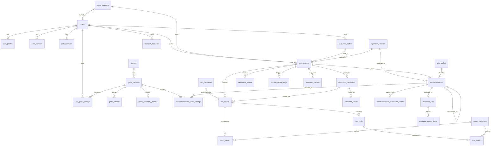

# 20 — Data Model

Related: [21-database-strategy.md](21-database-strategy.md) · [22-telemetry-strategy.md](22-telemetry-strategy.md) · [23-security-and-privacy.md](23-security-and-privacy.md)

PostgreSQL. Drizzle ORM. Manageable in DBeaver — meaning: real foreign keys, real constraints,
readable names, no ORM-only magic, and no schema that only makes sense from application code.

---

## 20.1 Conventions

| Convention | Rule |
|---|---|
| Primary keys | `uuid` (v7 preferred for index locality), generated application-side |
| Naming | `snake_case`, plural table names, singular column names |
| Timestamps | `timestamptz`, always UTC. `created_at` everywhere; `updated_at` on mutable tables |
| Soft delete | `deleted_at timestamptz` only where history must survive (users, hardware profiles) |
| Enums | PostgreSQL `enum` types for closed, stable vocabularies; `text` + FK to a lookup table where the vocabulary grows |
| Money/units | None. All measurements `double precision`; DPI `integer` |
| JSONB | Permitted **only** for: test configuration, algorithm parameter snapshots, environment fingerprints, and adapter source references. Never for relational business data (`SENS-BR` intent, ADR-011) |
| Nullability | Columns are `NOT NULL` unless absence is semantically meaningful. "Unknown" is modelled explicitly where it matters (e.g. `dpi_source`) |
| Ownership | Every user-owned table carries `user_id`; every query filters on it in SQL (`SENS-BR-034`) |

---

## 20.2 Entity relationship overview



---

## 20.3 Identity and access

### `users`
| Column | Type | Notes |
|---|---|---|
| `id` | uuid PK | |
| `email` | citext UNIQUE NOT NULL | citext so uniqueness is case-insensitive |
| `email_verified_at` | timestamptz NULL | |
| `status` | enum(`active`,`suspended`,`pending_deletion`) NOT NULL | |
| `deletion_scheduled_at` | timestamptz NULL | |
| `created_at`, `updated_at`, `deleted_at` | timestamptz | |

No password column here — credentials live in `auth_identities` so that a password account and an
OAuth account are the same shape from day one.

### `auth_identities`
| Column | Type | Notes |
|---|---|---|
| `id` | uuid PK | |
| `user_id` | uuid FK → users ON DELETE CASCADE | |
| `provider` | enum(`password`,`google`,`discord`) NOT NULL | |
| `provider_account_id` | text NOT NULL | for `password`, the normalised email |
| `secret_hash` | text NULL | Argon2id hash; NULL for OAuth |
| `created_at`, `updated_at` | | |

`UNIQUE (provider, provider_account_id)` · `UNIQUE (user_id, provider)`

### `auth_sessions`
| Column | Type | Notes |
|---|---|---|
| `id` | uuid PK | |
| `user_id` | uuid FK → users ON DELETE CASCADE | |
| `token_hash` | bytea NOT NULL UNIQUE | SHA-256 of the opaque token; the token itself is never stored |
| `issued_at`, `expires_at`, `last_seen_at` | timestamptz | sliding expiry with an absolute cap |
| `revoked_at` | timestamptz NULL | |
| `user_agent_hash`, `ip_hash` | bytea NULL | salted hashes, 30-day retention (doc 23 §23.9) |

Index: `(user_id, expires_at)` · partial index on `revoked_at IS NULL`.

### `auth_tokens`
Single table for email verification and password reset, discriminated by `purpose`.

| Column | Type | Notes |
|---|---|---|
| `id` | uuid PK | |
| `user_id` | uuid FK → users | |
| `purpose` | enum(`email_verify`,`password_reset`) | |
| `token_hash` | bytea NOT NULL UNIQUE | |
| `expires_at` | timestamptz NOT NULL | |
| `consumed_at` | timestamptz NULL | single-use, enforced in the transaction |

### `guest_sessions`
| Column | Type | Notes |
|---|---|---|
| `id` | uuid PK | |
| `token_hash` | bytea NOT NULL UNIQUE | from an HttpOnly cookie |
| `created_at`, `expires_at` | timestamptz NOT NULL | default 7 days (`SENS-BR-003`) |
| `claimed_by_user_id` | uuid FK → users NULL | |
| `claimed_at` | timestamptz NULL | |

The claim flow (doc 23 §23.6) reads the cookie, resolves this row, and reassigns owned
`test_sessions`. A client-supplied session id is never accepted.

### `user_profiles`
`user_id` PK/FK, `display_name`, `locale`, `unit_preference` enum(`metric`,`imperial`),
`motion_preference` enum(`system`,`reduced`,`full`), `created_at`, `updated_at`.

---

## 20.4 Games and adapters

### `games`
`id` uuid PK · `slug` text UNIQUE NOT NULL · `display_name` text NOT NULL ·
`display_name_localized` jsonb NOT NULL DEFAULT `'{}'` · `region` enum(`global`,`cn`,`other`) ·
`engine_family` text NULL · `status` enum(`supported`,`beta`,`planned`,`retired`) ·
`sort_order` int NOT NULL · `created_at`, `updated_at`.

### `game_versions`
| Column | Type | Notes |
|---|---|---|
| `id` | uuid PK | |
| `game_id` | uuid FK → games | |
| `version_label` | text NOT NULL | build/patch identifier |
| `effective_from` | date NOT NULL | |
| `is_current` | boolean NOT NULL | partial unique index ensures one current per game |
| `verification_status` | enum(`verified`,`partial`,`needs_recheck`,`unverified`) NOT NULL | |
| `verified_at` | timestamptz NULL | |
| `verified_against_build` | text NULL | |
| `source_refs` | jsonb NOT NULL DEFAULT `'[]'` | evidence pointers (justified JSONB: a heterogeneous, append-only list of references) |
| `adapter_module_version` | text NOT NULL | must match the compiled adapter at boot |

`UNIQUE (game_id, version_label)` · partial `UNIQUE (game_id) WHERE is_current`.

### `game_scopes`
`id` · `game_version_id` FK · `scope_key` enum(`hipfire`,`ads`,`x1`,`x2`,`x3`,`x4`,`x6`,`x8`) ·
`display_name_localized` jsonb · `magnification` numeric NULL ·
`has_separate_setting` boolean · `setting_label_localized` jsonb ·
`sort_order` int.
`UNIQUE (game_version_id, scope_key)`

### `game_sensitivity_models`
One row per `(game_version, scope)`.

| Column | Type | Notes |
|---|---|---|
| `id` | uuid PK | |
| `game_version_id` | uuid FK | |
| `scope_key` | enum | |
| `model_form` | enum(`linear_yaw`,`table`,`piecewise`) NOT NULL | |
| `params` | jsonb NOT NULL | form-specific; justified JSONB (shape varies by form) |
| `setting_min`, `setting_max`, `setting_step` | numeric NOT NULL | |
| `setting_decimals` | smallint NOT NULL | |
| `ads_model` | enum(`raw_multiplier`,`internally_fov_scaled`,`unknown`) NOT NULL | doc 11 §11.6.4 |
| `fov_axis` | enum(`horizontal`,`vertical`) NULL | |
| `fov_scaling` | text NULL | declared convention |
| `fov_min`, `fov_max` | numeric NULL | |
| `default_match_criterion` | enum(`focal_length`,`monitor_distance`,`distance_360`) NULL | |
| `default_match_coefficient` | numeric NULL | |
| `verification_status` | enum(same as above) NOT NULL | **scope-level**, not game-level |
| `created_at` | | |

`UNIQUE (game_version_id, scope_key)` · CHECK `setting_min < setting_max` ·
CHECK `setting_step > 0`.

### `user_game_settings`
The user's own current in-game settings, per hardware profile.
`id` · `user_id` FK · `game_version_id` FK · `hardware_profile_id` FK NULL · `scope_key` ·
`sensitivity` numeric · `fov_deg` numeric NULL · `source` enum(`user_entered`,`from_recommendation`) ·
`created_at`, `updated_at`.
`UNIQUE (user_id, game_version_id, hardware_profile_id, scope_key)`

---

## 20.5 Algorithm versioning

### `algorithm_versions`
| Column | Type | Notes |
|---|---|---|
| `id` | uuid PK | |
| `kind` | enum(`scoring`,`calibration`,`confidence`,`aim_profile`,`reference_distribution`) | |
| `version_label` | text NOT NULL | e.g. `scoring_model_v1` |
| `params` | jsonb NOT NULL | the full immutable parameter set |
| `params_hash` | bytea NOT NULL | verified against the loaded parameters at boot |
| `released_at` | timestamptz NOT NULL | |
| `deprecated_at` | timestamptz NULL | |
| `notes` | text | |

`UNIQUE (kind, version_label)`.
**Insert-only.** A `BEFORE UPDATE` trigger raises unless only `deprecated_at`/`notes` changed
(`SENS-BR-029`).

### `test_definitions`
`id` · `key` text · `version` int · `display_name` · `category` enum ·
`config` jsonb NOT NULL (justified: declarative test configuration, doc 19 §19.9) ·
`engine_min_version` text · `created_at`.
`UNIQUE (key, version)`

### `metric_definitions`
The controlled vocabulary behind `trial_metrics` / `round_metrics`.

`key` text PK · `display_name` · `unit` text · `direction` enum(`higher_better`,`lower_better`,`neutral`) ·
`aggregation` enum(`median`,`mean`,`time_weighted_mean`,`proportion`,`rms`) ·
`description` text · `is_decision_metric` boolean · `version` int.

---

## 20.6 Hardware

### `hardware_profiles`
| Column | Type | Notes |
|---|---|---|
| `id` | uuid PK | |
| `user_id` | uuid FK → users NULL | NULL for guest ad-hoc profiles |
| `guest_session_id` | uuid FK → guest_sessions NULL | |
| `name` | text NOT NULL | "Main Gaming Setup" |
| `dpi` | integer NOT NULL | CHECK between 100 and 32000 |
| `dpi_source` | enum(`known`,`assumed`,`estimated`) NOT NULL | |
| `polling_rate_hz` | integer NULL | |
| `mouse_model` | text NULL | free text at MVP |
| `grip` | enum(`palm`,`claw`,`fingertip`,`unknown`) NULL | |
| `mousepad_width_mm`, `mousepad_height_mm` | integer NULL | |
| `monitor_width_px`, `monitor_height_px` | integer NULL | |
| `refresh_rate_hz` | integer NULL | |
| `os_family` | enum(`windows`,`macos`,`linux`,`other`) NULL | |
| `windows_pointer_speed` | smallint NULL | CHECK 1–11; context only (doc 11 §11.8) |
| `enhance_pointer_precision` | boolean NULL | |
| `is_default` | boolean NOT NULL DEFAULT false | |
| `created_at`, `updated_at`, `deleted_at` | | |

CHECK: exactly one of `user_id` / `guest_session_id` is non-null.
Partial `UNIQUE (user_id) WHERE is_default AND deleted_at IS NULL`.

---

## 20.7 Sessions and the search

### `test_sessions`
| Column | Type | Notes |
|---|---|---|
| `id` | uuid PK | |
| `user_id` | uuid FK NULL | |
| `guest_session_id` | uuid FK NULL | exactly one of the two, CHECK enforced |
| `hardware_profile_id` | uuid FK NULL | |
| `hardware_snapshot` | jsonb NOT NULL | **immutable copy** (`SENS-BR-035`) |
| `primary_game_version_id` | uuid FK NULL | NULL for the generic path |
| `mode` | enum(`quick`,`standard`,`advanced`,`validation`,`fine_tune`) NOT NULL | |
| `status` | enum(`created`,`in_progress`,`paused`,`completed`,`abandoned`,`invalidated`) NOT NULL | |
| `environment` | jsonb NOT NULL | fingerprint (§20.12) |
| `environment_class` | enum(`pass`,`degraded`) NOT NULL | |
| `seed` | bigint NOT NULL | |
| `parent_session_id` | uuid FK → test_sessions NULL | validation / fine-tune / re-calibration lineage |
| `scoring_version_id`, `calibration_version_id`, `confidence_version_id` | uuid FK → algorithm_versions NOT NULL | |
| `started_at` | timestamptz NOT NULL | |
| `completed_at` | timestamptz NULL | |
| `created_at`, `updated_at` | | |

Indexes: `(user_id, started_at DESC)` · `(guest_session_id)` · `(status, updated_at)` for the
abandonment sweeper · `(hardware_profile_id, started_at DESC)`.

### `session_quality_flags`
`session_id` FK · `flag` enum(`no_raw_input`,`frame_degradation`,`unstable_pointer_lock`,
`long_gap`,`window_resized`,`dpi_inconsistent`,`high_invalid_rate`,`drift_fallback`) ·
`detail` jsonb NULL · `created_at`.
`PRIMARY KEY (session_id, flag)`

A separate table rather than an array column so flags are queryable and joinable for the quality
dashboards (doc 22 §22.7).

### `calibration_candidates`
| Column | Type | Notes |
|---|---|---|
| `id` | uuid PK | |
| `session_id` | uuid FK | |
| `round_index` | smallint NOT NULL | |
| `candidate_index` | smallint NOT NULL | |
| `counts_per_360` | double precision NOT NULL | **canonical** |
| `cm_per_360` | double precision NOT NULL | derived at write time |
| `blind_label` | text NOT NULL | shown to the client; shuffled per round |
| `source` | enum(`initial`,`narrowed`,`shifted`,`anchor`,`fine_tune`,`validation_original`,`validation_recommended`) NOT NULL | |
| `created_at` | | |

`UNIQUE (session_id, round_index, candidate_index)`

### `calibration_rounds`
One row per adaptive step — the audit trail of the search.

`id` · `session_id` FK · `round_index` · `bracket_low`, `bracket_high` (log2) ·
`fit_b0`, `fit_b1`, `fit_b2`, `fit_r2_adj`, `fit_concave` ·
`x_star`, `x_star_ci_low`, `x_star_ci_high` (nullable) ·
`drift_form` enum(`spline`,`linear_fallback`), `drift_delta`, `drift_condition_number` ·
`mde` double precision · `decision` enum(`narrow`,`narrow_conservative`,`shift`,
`stop_converged`,`stop_indistinguishable`,`stop_budget`,`stop_quality`,`stop_fatigue`) NOT NULL ·
`created_at`.
`UNIQUE (session_id, round_index)`

### `test_rounds`
A block: one candidate × one test.

| Column | Type | Notes |
|---|---|---|
| `id` | uuid PK | |
| `session_id` | uuid FK | |
| `candidate_id` | uuid FK NULL | NULL for sensitivity-independent tests (reaction, comfort) |
| `test_definition_id` | uuid FK | |
| `scope_key` | enum NOT NULL DEFAULT `hipfire` | present from Phase 1 for post-MVP scope work |
| `block_index` | smallint NOT NULL | global block order within the session |
| `presentation_order` | integer NOT NULL | global, monotonic; the idempotency key component |
| `is_practice` | boolean NOT NULL | |
| `status` | enum(`pending`,`in_progress`,`completed`,`invalidated`) NOT NULL | |
| `config_overrides` | jsonb NOT NULL DEFAULT `'{}'` | justified JSONB |
| `started_at`, `completed_at` | | |

`UNIQUE (session_id, presentation_order)` — this is what makes ingest idempotent
(`SENS-NFR-016`). Index `(session_id, block_index)`.

### `test_trials`
| Column | Type | Notes |
|---|---|---|
| `id` | uuid PK | |
| `round_id` | uuid FK ON DELETE CASCADE | |
| `trial_index` | smallint NOT NULL | |
| `is_practice` | boolean NOT NULL | |
| `validity` | enum(`valid`,`degraded`,`invalid`) NOT NULL | |
| `invalid_reason` | enum(...) NULL | CHECK: non-null iff `validity = 'invalid'` |
| `is_replacement` | boolean NOT NULL DEFAULT false | |
| `start_offset_ms` | double precision NOT NULL | relative to session start |
| `duration_ms` | double precision NOT NULL | |
| `hit` | boolean NULL | |
| `shots` | smallint NOT NULL DEFAULT 0 | |
| `target_angular_radius_deg` | double precision NULL | |
| `target_distance_deg` | double precision NULL | |
| `target_direction_deg` | double precision NULL | |
| `stimulus_seed` | bigint NOT NULL | reproduces the exact stimulus |
| `clean_frame_fraction` | real NOT NULL | |
| `quality_flags` | text[] NOT NULL DEFAULT `'{}'` | small, non-relational, low-cardinality |

`UNIQUE (round_id, trial_index)` · index `(round_id)`.

### `trial_metrics`
| Column | Type |
|---|---|
| `trial_id` | uuid FK ON DELETE CASCADE |
| `metric_key` | text FK → metric_definitions |
| `value` | double precision NOT NULL |

`PRIMARY KEY (trial_id, metric_key)`.

**Design note — why a narrow keyed table rather than a wide one.** The metric set is extensible
(post-MVP tests add metrics), sparse (a tracking metric is meaningless on a flick trial), and
governed by a registry that already exists for other reasons. A wide table would need a migration
per new metric and would be mostly NULL. The costs — more rows and no per-metric type safety at
the database level — are mitigated by the composite PK (which is also the covering index for the
only access pattern: "all metrics for these trials"), by the FK to `metric_definitions` (which
makes the vocabulary closed), and by the fact that this table is written in bulk and read in bulk,
never queried by arbitrary metric filters. ADR-012 records the trade-off.

### `round_metrics`
Aggregates, so the common read path never touches `trial_metrics`.

`round_id` FK · `metric_key` FK · `value` double precision NOT NULL ·
`n_valid`, `n_invalid`, `n_degraded` integer NOT NULL ·
`robust_sd`, `ci_low`, `ci_high` double precision NULL.
`PRIMARY KEY (round_id, metric_key)`

**Constraint:** `n_valid >= 0` and a value may not be stored without its sample counts
(doc 10 §10.10) — enforced by NOT NULL on the count columns.

### `candidate_scores`
`candidate_id` FK · `dimension_key` text · `score` double precision · `se` double precision ·
`n` integer · `alpha_hat` double precision NULL (the de-drifted candidate effect) ·
`scoring_version_id` FK.
`PRIMARY KEY (candidate_id, dimension_key)`

---

## 20.8 Results

### `aim_profiles`
`key` text PK · `display_name_localized` jsonb · `description_localized` jsonb ·
`rule_version` text.

### `recommendations`
| Column | Type | Notes |
|---|---|---|
| `id` | uuid PK | |
| `session_id` | uuid FK UNIQUE | one recommendation per session |
| `verdict` | enum(`peak_found`,`indistinguishable`) NOT NULL | |
| `recommended_counts_360` | double precision NULL | **canonical**; NULL iff verdict is `indistinguishable` |
| `recommended_cm_360` | double precision NULL | derived |
| `hp_range_low_cm360`, `hp_range_high_cm360` | double precision NULL | statistical interval |
| `hp_range_level` | real NOT NULL DEFAULT 0.90 | |
| `comfort_range_low_cm360`, `comfort_range_high_cm360` | double precision NOT NULL | always present |
| `constraint_max_cm360` | double precision NULL | |
| `constraint_source` | enum(`pad_width`,`measured`,`none`) NOT NULL | |
| `confidence_index` | smallint NOT NULL | CHECK 0–100 |
| `confidence_breakdown` | jsonb NOT NULL | the seven components (justified: a fixed-shape analytic payload, never joined) |
| `settings_reliability` | enum(`normal`,`estimated_dpi`,`assumed_dpi`) NOT NULL | |
| `aim_profile_key` | text FK → aim_profiles NULL | |
| `aim_profile_explanation` | jsonb NOT NULL | structured, localisable, with the cited values |
| `response_curve` | jsonb NOT NULL | everything needed to redraw (doc 16 §16.7) |
| `accepted_counts_360` | double precision NULL | what the user is actually told to use after validation (may equal the original) |
| `scoring_version_id`, `calibration_version_id`, `confidence_version_id` | uuid FK NOT NULL | `SENS-BR-020` |
| `parent_recommendation_id` | uuid FK NULL | |
| `superseded_by_id` | uuid FK NULL | |
| `created_at` | | |

CHECK: `verdict = 'peak_found'` ⇒ `recommended_counts_360 IS NOT NULL`.
CHECK: `comfort_range_low <= comfort_range_high`.
CHECK: when both ranges exist, the comfort range contains the high-performance range.

### `recommendation_dimension_scores`
`recommendation_id` FK · `dimension_key` text · `score` real NOT NULL ·
`shape` real NOT NULL · `is_provisional` boolean NOT NULL · `n` integer NOT NULL.
`PRIMARY KEY (recommendation_id, dimension_key)`

### `recommendation_game_settings`
| Column | Type | Notes |
|---|---|---|
| `id` | uuid PK | |
| `recommendation_id` | uuid FK ON DELETE CASCADE | |
| `game_version_id` | uuid FK | |
| `scope_key` | enum | |
| `dpi` | integer NOT NULL | the DPI the conversion assumed |
| `setting_value` | numeric NOT NULL | |
| `ideal_setting_value` | numeric NOT NULL | pre-quantisation |
| `achieved_counts_360` | double precision NOT NULL | recomputed from the quantised value |
| `quantisation_error_pct` | real NOT NULL | |
| `was_clamped` | boolean NOT NULL | |
| `fov_deg` | numeric NULL | |
| `conversion_method` | enum(`direct`,`focal_length`,`monitor_distance`,`distance_360`) NOT NULL | |
| `conversion_coefficient` | real NULL | |
| `adapter_version` | text NOT NULL | `SENS-BR-026` |
| `created_at` | | |

`UNIQUE (recommendation_id, game_version_id, scope_key, conversion_method)`

**No row is ever written for an unverified model** (`SENS-BR-014`) — the absence of a row *is*
the unverified state, so there is no possibility of a stale number leaking into an export, a
share card, or a future feature.

### `validation_runs`
`id` · `recommendation_id` FK UNIQUE · `session_id` FK (the validation session) ·
`baseline_counts_360`, `candidate_counts_360` double precision ·
`verdict` enum(`improved`,`no_measurable_difference`,`worse`) NOT NULL ·
`composite_delta`, `composite_ci_low`, `composite_ci_high` double precision ·
`block_count` smallint · `confidence_before`, `confidence_after` smallint · `created_at`.

### `validation_metric_deltas`
`validation_run_id` FK · `metric_key` FK · `delta` double precision ·
`delta_pct` real · `ci_low`, `ci_high` double precision · `is_significant` boolean NOT NULL.
`PRIMARY KEY (validation_run_id, metric_key)`

### `subjective_preferences`
`session_id` FK · `chosen_candidate_id` FK · `created_at`.
Recorded, never used in any computation (doc 17 §17.8).

---

## 20.9 Telemetry and consent

### `research_consents`
`id` · `user_id` FK NULL · `guest_session_id` FK NULL · `scope` enum(`raw_telemetry`,`aggregate_research`) ·
`policy_version` text · `granted_at` · `revoked_at` NULL.

### `telemetry_batches`
Pointers only — **no raw samples in PostgreSQL** (`SENS-BR-032`).

`id` · `session_id` FK · `round_id` FK NULL · `storage_key` text NOT NULL ·
`format` enum(`binary_v1`) · `sample_count` integer · `byte_size` integer ·
`consent_id` FK NOT NULL · `retention_expires_at` timestamptz NOT NULL · `created_at`.

`consent_id` is NOT NULL by design: a batch cannot exist without a consent record backing it.

### `analytics_events`
`id` · `session_id` FK NULL · `user_id` FK NULL · `event_key` text NOT NULL ·
`properties` jsonb NOT NULL · `occurred_at` timestamptz NOT NULL.
Index `(event_key, occurred_at)`. Bounded property schema enforced in the application
(doc 22 §22.6).

---

## 20.10 Indexes

Driven by actual query patterns, not speculation.

| Query | Index |
|---|---|
| History list for a user | `test_sessions (user_id, started_at DESC)` |
| Session detail load | PK lookups + `test_rounds (session_id, block_index)` |
| Round aggregate read for a result | `round_metrics (round_id)` = the PK |
| Trial drill-down / recompute | `test_trials (round_id)`, `trial_metrics` PK |
| Response curve | `calibration_candidates (session_id, round_index)`, `candidate_scores` PK |
| Abandonment sweeper | `test_sessions (status, updated_at)` partial `WHERE status IN ('created','in_progress','paused')` |
| Guest expiry sweeper | `guest_sessions (expires_at)` partial `WHERE claimed_by_user_id IS NULL` |
| Auth session lookup | `auth_sessions (token_hash)` = the unique index |
| Adapter resolution | `game_versions (game_id) WHERE is_current` |
| Quality dashboards | `session_quality_flags (flag)`, `analytics_events (event_key, occurred_at)` |

Deliberately **not** indexed at MVP: `trial_metrics (metric_key)` — no query filters by metric
alone, and the index would be large and useless. Revisit if research querying begins.

---

## 20.11 Retention

| Data | Retention | Mechanism |
|---|---|---|
| Unclaimed guest sessions + their sessions, rounds, trials, metrics, recommendations | 7 days | Nightly job, cascade delete |
| Abandoned sessions (registered) | 90 days | Nightly job |
| Raw telemetry batches | 30 days default, consent-bounded | Object-store lifecycle rule + `retention_expires_at` sweep |
| `auth_sessions` (expired/revoked) | 30 days | Nightly job |
| `ip_hash` / `user_agent_hash` | 30 days | Nulled by the same job |
| `analytics_events` | 400 days | Partition drop |
| Completed sessions of registered users | Indefinite, until account deletion | — |
| Account deletion | Soft-delete immediately, hard purge after 30 days | Scheduled job (doc 23 §23.11) |

---

## 20.12 The environment fingerprint

`test_sessions.environment` (JSONB, fixed shape, validated by Zod — justified because it is
written once, read whole, and never joined):

```
{
  viewport: { w, h },
  screen: { w, h },
  devicePixelRatio,
  estimatedRefreshHz,
  frameProbe: { meanMs, p95Ms, maxMs, lateFrameRatio, sampleCount },
  pointerLock: { supported, unadjustedMovementRequested, unadjustedMovementEffective },
  browser: { name, majorVersion },
  os: { family },
  canvas: { cssWidth, cssHeight, backingWidth, backingHeight },
  fovHDeg, aspectRatio,
  testConfigVersion, engineVersion,
  timezoneOffsetMinutes
}
```

No fingerprinting beyond what measurement quality requires (doc 23 §23.9). No user agent string
is stored raw; browser name and major version only.

---

## 20.13 Improvements over the schema sketched in the brief

| Brief | This model | Why |
|---|---|---|
| `user_profiles` | kept | — |
| `games`, `game_versions`, `game_sensitivity_profiles` | `game_sensitivity_models` **+ `game_scopes`** | Verification status must be tracked per scope, not per game; scope roster is per version |
| `test_metrics` (one table) | `metric_definitions` + `trial_metrics` + `round_metrics` | Separates vocabulary, raw and aggregate; the read path never scans trial-level data |
| — | `calibration_rounds` | The search itself needs an audit trail (FR-069); without it a recommendation cannot be explained |
| — | `session_quality_flags` | `SENS-BR-010` requires degradation to be queryable, not buried in JSON |
| — | `guest_sessions` | Guest-first (`SENS-BR-001`) needs a server-side identity to make the claim flow safe |
| — | `auth_identities` | OAuth-shaped from day one at no cost |
| — | `validation_runs`, `validation_metric_deltas`, `subjective_preferences` | Validation is a first-class product feature, not a note on a recommendation |
| — | `telemetry_batches`, `research_consents` | Consent must be a row, not a boolean |
| `recommendations` | + verdict, two ranges, constraint, breakdown, response curve, accepted value, supersession | Doc 16's output object is richer than a single number |
| implicit | `test_rounds.presentation_order` UNIQUE | The idempotency key that makes ingest safe |
| implicit | `hardware_snapshot` on the session | `SENS-BR-035`; editing a profile must not rewrite history |
